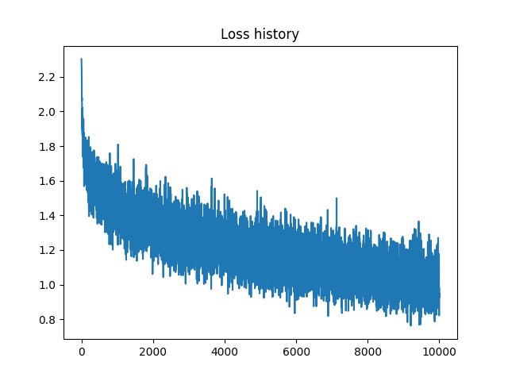

# Batch normalization and Dropout. Advanced optimization.  
datetime: 2023-10-27 22:05:09  
Well done in: 196 seconds  
learning_rate = 0.008  
reg = 0.32  
num_iters = 10000  
batch_size = 128  

Final loss: 0.9783467511161161   
Train accuracy: 0.65988   
Test accuracy: 0.5094  

